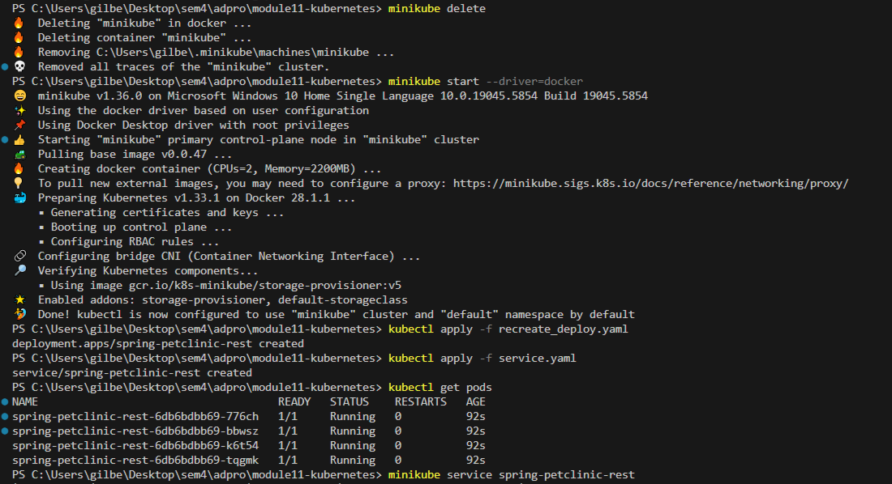
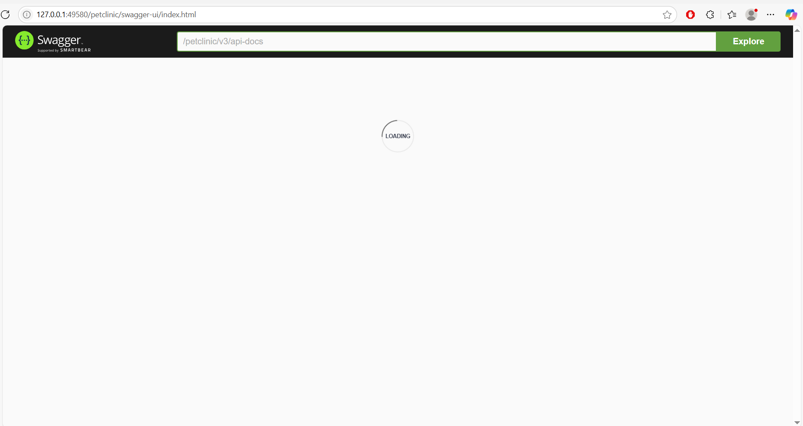

# Gilbert Kristian - 2306274951 - Adpro A

## Tutorial: Hello Minikube

1. Compare the application logs before and after you exposed it as a Service. Try to open the app several times while the proxy into the Service is running. What do you see in the logs? Does the number of logs increase each time you open the app?<br><br>


    When accessing the application directly inside the pod before exposing it as a service, the logs show only the initial startup messages "Started HTTP server on port 8080 & Started UDP server on port 8081." This is seen in the log at 10:46:38.

    Once the application is exposed as a service, the initial startup messages continue to appear in the logs. In addition, the logs now capture incoming requests that pass through the service, allowing external access to the application.

    For example, the screenshot shows a GET request logged at 10:49:57 and another at 10:49:58. Each time the application is accessed or refreshed in the browser, more log entries appear because the browser sends GET requests to the service.

    This illustrates that exposing the pod via a Kubernetes service allows external traffic to reach the app, which results in an increase in log entries.

2. Notice that there are two versions of kubectl get invocation during this tutorial section. The first does not have any option, while the latter has -n option with value set to kube-system. What is the purpose of the -n option and why did the output not list the pods/services that you explicitly created? 

    The -n option in the `kubectl` get command is used to specify a particular namespace in Kubernetes. This is especially helpful when multiple services share the same name across different namespaces. If we omit the -n flag, `kubectl` get will default to showing resources from the default namespace. Namespaces serve to isolate resources within a cluster, allowing better organization and management. For example, using -n kube-system will display resources within the kube-system namespace, which contains core Kubernetes components like DNS and the API server. Without specifying -n, the command only shows user-created resources in the default namespace.

## Tutorail: Rolling Update & Kubernetes Manifest File

1. What is the difference between Rolling Update and Recreate deployment strategy?

    Rolling Update avoids downtime by updating pods gradually, while Recreate Deployment causes downtime by stopping all old pods before starting new ones.

    With Recreate Deployment, all the old version pods are stopped first before the new version pods start. This means the app isn’t available for a while during the update.

    Rolling Update works differentlym it updates the app little by little. It creates new pods one at a time while the old pods keep running, so the app stays up and running without any downtime.

2. Try deploying the Spring Petclinic REST using Recreate deployment strategy and document your attempt.<br><br>
    <b>Here are my steps for using Recreate deployment strategy:</b>

<br><br>
<b>Endpoint access to `/petclinic`</b>


3. Prepare different manifest files for executing Recreate deployment strategy.<br>
    In the previous section, I followed the steps using a manifest file named recreate_deploy.yaml. This file was created by modifying the original deployment.yaml and changing the deployment strategy from RollingUpdate to Recreate.
    
    ```yaml
    strategy:
    type: Recreate
    ```

4. What do you think are the benefits of using Kubernetes manifest files? Recall your experience in deploying the app manually and compare it to your experience when deploying the same app by applying the manifest files (i.e., invoking kubectl apply -f command) to the cluster.

    Using manifest files massively cuts down human errors during app deployment. Instead of relying on manual steps every time, the deployment process is clearly documented in these files. This way, managing app configurations becomes automated and consistent, eliminating guesswork and reducing the chance of mistakes from coders.


